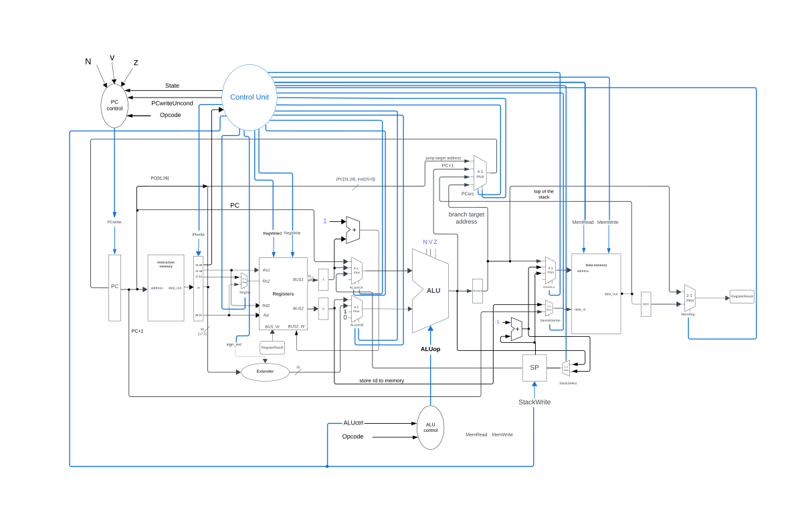
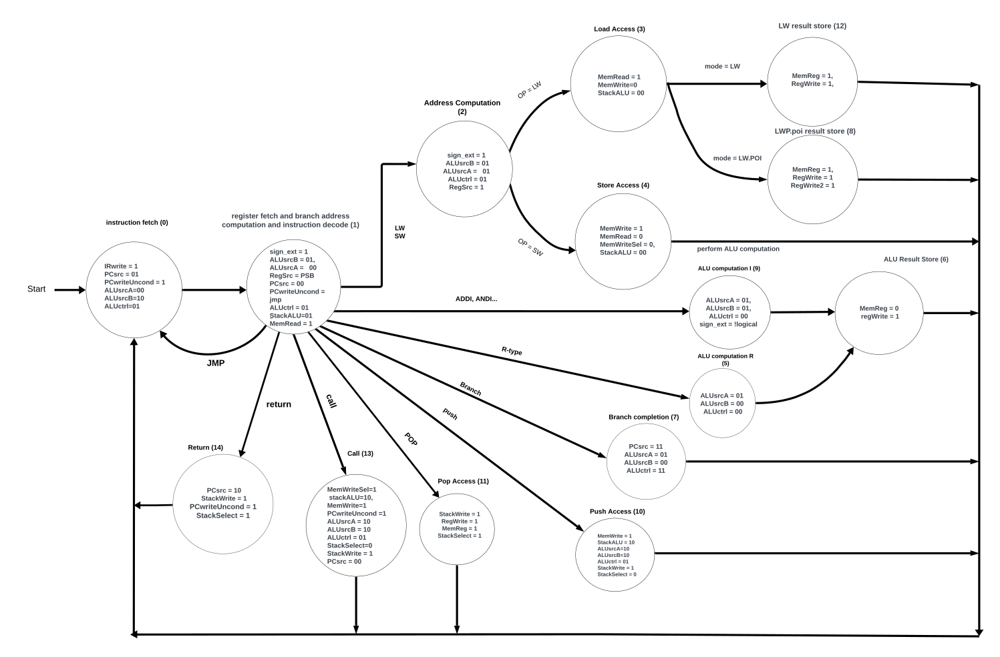

# Multicycle RISC Processor Design

This repository contains the Verilog source code of the design of a multicycle RISC processor. Additional details regarding the ISA, implementation, and verification can be explored in the provided PDF [report](docs/Report.pdf).

# Table of Contents

1. [Overview](#overview)
2. [Objectives](#objectives)
3. [Processor Specifications](#processor-specifications)
4. [Instruction Set Architecture (ISA) & Opcodes](#instruction-set-architecture-isa--opcodes)
5. [Multicycle Stages](#multicycle-stages)
6. [Design and State Diagram of the Control Unit](#design-and-state-diagram-of-the-control-unit)
   - [Datapath](#datapath)
   - [State Diagram](#main-control-state-diagram)
7. [Dependencies](#dependencies)
8. [Repository File Structure](#repository-file-structure)
9. [How to Use](#how-to-use)
   - [Git Clone](#git-clone)
   - [Running the Assembler](#running-the-assembler)
   - [Running the Makefile](#running-the-makefile)
10. [Acknowledgements](#acknowledgements)
11. [Team](#team)

## Overview

This project focuses on designing and verifying a simple multicycle RISC processor using Verilog, for educational purposes in **Computer Architecture**. The processor is built with multiple cycles per instruction and supports various instruction types and a custom Instruction Set Architecture (ISA).

## Objectives

- **Design** a 32-bit multicycle RISC processor.
- **Implement** and simulate code sequences to verify the functionality of the processor.
- **Write a testbench** to test the processor’s operations.

## Processor Specifications

1. **Instruction and Word Size**: 32 bits
2. **Registers**: 
   - 16 general-purpose registers (R0 to R15) where R0 is hardwired to 0.
   - A 32-bit Program Counter (PC).
   - A 32-bit Stack Pointer (SP), which points to the topmost empty element of the stack.
3. **Memory Layout**:
   - Static data segment
   - Code segment
   - Stack segment (LIFO structure, with explicit push/pop instructions for stack management).
4. **Memory**:
   - Separate instruction and data memories.
   - Word-addressable memory.
5. **Instruction Types**:
   - R-type (Register)
   - I-type (Immediate)
   - J-type (Jump)
   - S-type (Store)
6. **ALU**: Generates required signals (zero, carry, overflow, etc.) to calculate the condition branch outcome (taken/not taken).

## Instruction Set Architecture (ISA) & Opcodes

The processor supports the following instructions, categorized by their type and accompanied by their opcode values:

| No. | Instr    | Meaning    | Opcode Value |
|---|---|---|---|
| **R-Type Instructions**    |    |    |    |
| 1    | AND    | Reg(Rd) = Reg(Rs1) & Reg(Rs2)    | `000000`    |
| 2    | ADD    | Reg(Rd) = Reg(Rs1) + Reg(Rs2)    | `000001`    |
| 3    | SUB    | Reg(Rd) = Reg(Rs1) - Reg(Rs2)    | `000010`    |
| **I-Type Instructions**    |    |    |    |
| 4    | ANDI    | Reg(Rd) = Reg(Rs1) & Imm<sup>16</sup>    | `000011`    |
| 5    | ADDI    | Reg(Rd) = Reg(Rs1) + Imm<sup>16</sup>    | `000100`    |
| 6    | LW    | Reg(Rd) = Mem(Reg(Rs1) + Imm<sup>16</sup>    | `000101`    |
| 7    | LW.POI    | Reg(Rd) = Mem(Reg(Rs1) + Imm<sup>16</sup><br>Reg[Rs1] = Reg[Rs1] + 1    | `000110`    |
| 8    | SW    | Mem(Reg(Rs1) + Imm<sup>16</sup>) = Reg(Rd)    | `000111`    |
| 9    | BGT    | if (Reg(Rd) > Reg(Rs1))<br>Next PC = PC + sign_extended (Imm<sup>16</sup>)<br>else PC = PC + 1    | `001000`    |
| 10   | BLT    | if (Reg(Rd) < Reg(Rs1))<br>Next PC = PC + sign_extended (Imm<sup>16</sup>)<br>else PC = PC + 1    | `001001`    |
| 11   | BEQ    | if (Reg(Rd) == Reg(Rs1))<br>Next PC = PC + sign_extended (Imm<sup>16</sup>)<br>else PC = PC + 1    | `001010`    |
| 12   | BNE    | if (Reg(Rd) != Reg(Rs1))<br>Next PC = PC + sign_extended (Imm<sup>16</sup>)<br>else PC = PC + 1    | `001011`    |
| **J-Type Instructions**    |    |    |    |
| 13   | JMP    | Next PC = {PC[31:26], Immediate<sup>26</sup>}    | `001100`    |
| 14   | CALL    | Next PC = {PC[31:26], Immediate<sup>26</sup>}<br>PC + 1 is pushed on the stack    | `001101`    |
| 15   | RET    | Next PC = top of the stack    | `001110`    |
| **S-Type Instructions**    |    |    |    |
| 16   | PUSH    | Rd is pushed on the top of the stack    | `001111`    |
| 17   | POP    | The top element of the stack is popped, and it is stored in the Rd register    | `010000`    |

## Multicycle Stages

The processor operates in multiple cycles per instruction:
1. **Fetch**: Retrieve instruction from memory.
2. **Decode**: Decode instruction and read registers.
3. **Execute**: Perform ALU operations.
4. **Memory Access**: Access memory (load/store).
5. **Write Back**: Write result back to register.

## Design and State Diagram of the Control Unit

### Datapath

The datapath of the multicycle RISC processor includes several components such as the ALU, registers, memory units, and control signals. The diagram below illustrates the connections between these components.



### Main Control State Diagram

The control unit of the multicycle RISC processor is responsible for generating the control signals required for each stage of the instruction cycle. The state diagram of the control unit defines the various states the processor goes through while executing an instruction.



### Design Description

- **Fetch State**: In this state, the processor fetches the instruction from memory.
- **Decode State**: The fetched instruction is decoded, and the necessary registers are read.
- **Execute State**: The ALU performs the required arithmetic or logical operation.
- **Memory Access State**: Depending on the instruction, memory is accessed for load/store operations.
- **Write Back State**: The result of the ALU operation or memory access is written back to the appropriate register.

Each state transitions to the next based on the control signals generated by the control unit, ensuring that the processor correctly executes each instruction.

## Dependencies

To work with this project, ensure you have the following dependencies installed:

- Python
- Verilator
- GTKWave
- Make

## Repository File Structure

Below is the structure of the repository:

- `src/`: Contains the Verilog source files for the multicycle RISC processor.
- `testcases/`: Includes assembly examples for verifying the CPU functionality.
- `assembler/`: Contains the Python scripts for assembling the assembly code into machine code.
- `docs/`: Documentation files detailing the design and functionality of the CPU.
- `Makefile`: The Makefile for compiling and running the Verilog code.
- `README.md`: This README file.

## How to Use

### Git Clone

First, clone the repository:
```bash
git clone https://github.com/yazan6546/MIPS-Multicycle-CPU-Using-Verilog.git
cd MIPS-Multicycle-CPU-Using-Verilog
```

### Running the Assembler

To run the assembler and generate machine code from assembly code, follow these steps:

1. Run the assembler script with your assembly file:
    ```bash
    ./run_assembler <testcase> <output_dir>
    ```
2. The output machine code will be generated in the specified output directory.

### Running the Makefile

To compile and run the Verilog code and testbench, use the provided Makefile. Follow these steps:

1. Run the Makefile to compile the code:
    ```bash
    make
    ```
2. Run the testbench:
    ```bash
    make run
    ```
3. To view the waveform files (.vcd) generated by the testbench using GTKWave, use the following command:
    ```bash
    gtkwave <path_to_vcd_file>
    ```

## Acknowledgements

- The project statement was prepared by my instructors, **Aziz Qaroush** and **Ayman Hroub**, at **BZU**.
- [customasm](https://hlorenzi.github.io/customasm/web/?fbclid=IwAR04c2OYqIuKfF8_CsOXjz62jWVuoH2OU_qp4EW0M8mgQ3RxgvCDhePUT94) - This repository proved as a useful tool for generating machine code for assembly code.

## Team
                
- [Yazan Abualoun](https://github.com/yazan6546)
- [Noor Mouadi](https://github.com/NoorMouadi)
- [Hazar Michael](https://github.com/hazarmichael)
